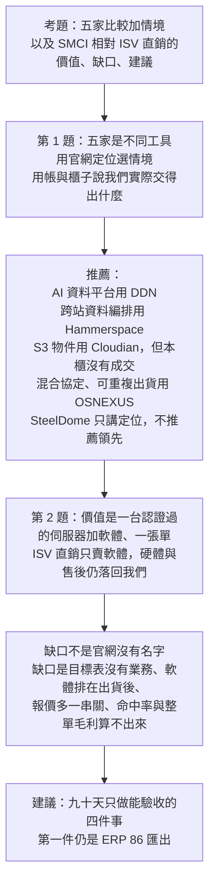
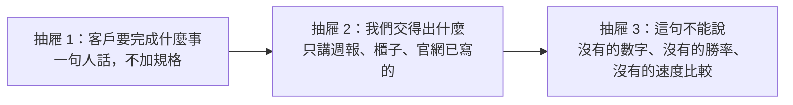

# 週五面試主線（給 Claude）

日期：2026-09-22。面試信已經到了。這份取代上一版「不要主動講產品」的走法。上一版沒有錯在證據，錯在沒有對上考題。Claude 已做好的 33 頁 `deck/out/vendor_deck.pptx` 不推翻、不刪、不加第 34 頁。它是附錄。週五口頭只走下面這條。

不要改 `00-導讀-Vendor銷售診斷.md`、`regression_results.json`、`combo_results.json`，也不要改三支原始腳本。

## 信裡要我們答的兩題

Panel interview，Jr PM，內部轉調。候選人現在在 Sales team 1。面板指定五家，不是 WEKA：

DDN、Hammerspace、Cloudian、OSNEXUS、SteelDome。

1. 簡短比較這五個 SDS，並說明什麼情境推薦哪一個。
2. SMCI SDS 的現況：相對 ISV 自己直銷，我們能提供什麼價值；你看到的缺口；改善建議。

主線不變，只是它回答第 2 題，不取代第 1 題：

> 軟體賣不出去，不是產品講不清楚，是誘因與流程沒有接上。

口頭用英文，因為邀請信用英文。工作筆記維持中文。

Claude 的第二件工作是教 Tuo。教完他要能不看稿回答這五家的任何追問。教法見最後一節，不要改成另做一門產品課。

## 想法流程

先證明會選產品，再講公司為什麼沒有把它賣成一個可重複的動作。箭頭是「所以呢」。

WEKA、VAST、機型長表、業務姓名是被問到才翻的附錄。它們證明「我們看過整本帳」，不是這封信的主語。

## 週五口頭頁序

沿用現成頁，不新做分析。約十分鐘。

| 順序 | 答哪一題 | 用什麼 | 只講這一句 |
|---|---|---|---|
| 1 | 開場 | 信的原文 | 我比較面板指定的五家，然後講 SMCI 相對 ISV 直銷能給什麼、缺口在哪、我建議先做什麼 |
| 2 | 第 1 題 | 官網一句話，見 `analysis/reference/supermicro_sds_2026-09-22.json` 的 `one_liner` | 五家不是同一種儲存。比較軸只有三個：資料服務是什麼、情境是什麼、本櫃交得出幾張 |
| 3 | 第 1 題 | 下表 | 情境推薦。沒有成交證據的不說成已經賣得動 |
| 4 | 第 2 題價值 | s02 的邊界加上這句 | 相對 ISV 直銷，我們能給的是認證伺服器、軟體、服務放在同一張單。ISV 直銷不管伺服器怎麼配、end-customer 怎麼登錄 |
| 5 | 第 2 題缺口 | s09 的方法，但主語換成這五家；流程用 s12p、s15 | 官網五家都有。帳上只有 DDN、Hammerspace、OSNEXUS 有數。Cloudian 與 Quantum 合欄，拆不出來。SteelDome 十三個月是 0 |
| 6 | 第 2 題建議 | s19b、s20、s21 | 九十天不改佣金制度。先讓這五家裡交得出貨的那幾家有一條報價路徑，並拿到 `86` 匯出 |
| 7 | 收 | s21 | 我從業務來，要做的 PM 工作是把會選產品的人、能核價的人、願意賣的人接上 |

## 第 1 題：五家怎麼比、什麼情境推薦哪一個

數字只許用已經進簡報或 JSON 的值。官網句子只許用 reference 檔裡那句，並說擷取日 2026-09-22。

| 廠商 | 它是什麼 | 什麼情境才推薦 | 我們交得出的證據 | 不准講的 |
|---|---|---|---|---|
| DDN | Infinia：AI 推論、分析、模型準備的物件與檔案。另外有 appliance | 客戶要的是 AI 資料平台或現成 appliance，而不是自組 NAS | 月窗入帳 $8,890,333；2025 該表 $1,832,606／目標 $2,000,000；櫃子 8 張 SO；去重後 6 筆交易裡 4 筆 appliance、2 筆 Infinia | 不要把 appliance 金額說成 Infinia 軟體賣得好 |
| Hammerspace | 全域命名空間，標準協定，用政策搬資料 | 資料散在多個站、要餵給運算，而不是單站一塊大磁碟 | 月窗 $2,296,311；零月比例 76.9%；不在目標表；櫃子 3 張 SO；寫出的搭配是 `SYS-122H-TN`，2 張 | 不要把 3 張說成已經有標準配置 |
| Cloudian | 企業級 S3 物件儲存，官網說已在 Supermicro 儲存伺服器認證 | 客戶要 S3、備份、歸檔、物件保存 | 櫃子 0 張。目標表與 Quantum 合欄，$537,527／$1,000,000，不能拆給 Cloudian | 不要報一個 Cloudian 業績 |
| OSNEXUS | QuantaStor：檔案、區塊、物件合一；scale-up 與 scale-out；官網列了合規與多種行業 | 混合協定、分公司、MSP、學校、醫療、政府，需要可重複的認證配置 | 櫃子 63 張 SO，五家裡唯一有重複出貨。`SFT-ON-QSEEMGS3` 27 張。2025 該表 $492,746／目標 $1,000,000 | 不要拿它去跟 DDN 比 AI 吞吐。帳上沒有這個比較 |
| SteelDome | HyperSERV：虛擬化加分散式儲存的超融合 | 只有客戶明確要 compute 與 storage 做在一起時，才放進候選 | 週報有列，十三個月金額和是 0；目標表無欄；櫃子 0 張；官網子頁沒有機型清單 | 不要推薦它領先。沒有成交就不要編一個成功情境 |

推薦時的優先順序，用證據強度說，不用喜好說：

- 交得出貨、情境清楚：OSNEXUS 是預設的可重複選項。
- 客戶問題是 AI 資料平台：改推 DDN，並先問是 appliance 還是 Infinia。
- 客戶問題是跨站資料搬移：改推 Hammerspace，並說明樣本只有 3 張。
- 客戶問題是 S3 物件：Cloudian 定位符合，但要同時說本櫃沒有成交，建議先做一張認證配置再拿去報價。
- SteelDome 留在表上回答「我知道它是什麼」，不放進「我會先賣這個」。

## 第 2 題：價值、缺口、建議

價值，對得上 ISV 直銷。這是我們能提供的結構，不是已經量到的勝率：

- ISV 直銷賣的是軟體權利。伺服器誰配、韌體、到貨、end-customer 登錄，客戶還是要自己找。
- SMCI 能提供的是官網已經寫過的認證伺服器，加上軟體與服務，放在同一張單。五家裡 OSNEXUS 的 63 張 SO 是這件事真的發生過；DDN 的 appliance 是另一種「整台交出去」。

缺口，沿用原主線，主語改成這五家：

- 產品名在官網上都有。缺的不是比較表。
- DDN 的金額高，但櫃子只有 8 張，而且 appliance 與 Infinia 混在一起。
- Hammerspace 有金額、不在目標表、幾乎沒有重複配置。
- Cloudian 沒有自己的業績欄。SteelDome 有欄位、金額是 0。
- 目標表的 owner 是採購、PM、工程師，沒有業務名字。這是事實。由此推論「業務沒有誘因」仍是假設，要佣金辦法和 quota 才算數。s15 必須說假設。
- 加了軟體的報價還要走 SAP、IBOM、CQ、BQ、PM、buyer。這是使用者經驗；郵件次數只是痕跡，不要說成每張必經。s12p 的註留著。
- 命中率和整單毛利仍然未估計。不要用櫃子裡的報價號當分母。

建議，九十天，只接這封信問的「improvement」：

1. OSNEXUS：把已經重複出現的配置寫成報價可用的規則，讓業務不用每張都重開 CQ。驗收是一份核准的配置，不是一句口號。
2. DDN：報價單上把 appliance 與 Infinia 分成兩條，避免帳上看起來像軟體賣得很好。
3. Hammerspace：只推已經寫出的 `SYS-122H-TN`，直到 Ready Node 有 owner。
4. Cloudian 與 SteelDome：先補認證配置和一個內部 owner，再放進業務話術。現在放進去會製造沒有成交回路的 pipeline。
5. 五份資料不變：ERP `86` 匯出、硬體 SO 對軟體 SO、硬體成本、佣金與 quota、業務名冊。沒有第一份，就不報告命中率。

## 不准因為對上考題就偏掉

- 不推翻 33 頁。被問到 WEKA、VAST、價差、業務集中度，翻原頁。
- 不在口頭點名業務。s10a 留在附錄。
- 不把行項目價差叫毛利。被問到才說 WEKA 中位 10.4%，並先說硬體成本未知。
- 不引用 `2026 Goal!N9`。不把五家金額加總後說成 SDS 總成績。
- 不把 SteelDome 的 0 說成「確定沒有市場」。0 是這本帳沒有入帳，不是市場結論。
- 不把「我來當橋」說成已經可以改佣金或取消 CQ。
- 不多做一頁產品優缺點。reference 裡的一句英文和中文摘要夠用。

## 怎麼教這五家

對象是 Tuo。他在 Sales team 1，不是第一次聽到儲存，但面板會從任何一家、任何方向追問。教學標準不是「講完」，是他能用英文在二十秒內答對，並且沒有說出檔案裡沒有的數字。

### 先教方法，再教五家

每一家都只用三個抽屜，永遠按這個順序答。Claude 自己講的時候也按這個順序，讓 Tuo 聽得出結構。

深入簡出的意思：

- 第一層是比喻，十秒。比喻要標成「我用這個幫你記，不是官網原文」。
- 第二層是「什麼時候選它、什麼時候改選另外四家之一」，六十秒。
- 第三層才是料號、機型、金額。只有 Tuo 問，或面板追問，才打開。第三層的每一個數字都要能指回 `one_liner`、`combo_results.json` 或週報那一列。
- 不要從架構圖開始教。不要先念 SKU。不要把 33 頁簡報當教材。

每教完一家，立刻問三題，不要連講五家再考：

1. 用一句英文說它是做什麼的。
2. 給一個該選它的客戶情境，再給一個該改選別人的情境。
3. 報一個我們有的數字，再主動說一個我們沒有、所以不能答的數字。

Tuo 答錯時只改那一句，不要重新演講。說了檔案裡沒有的延遲、排名、市占、毛利，立刻喊停。

五家都過了三題之後，才做一輪二十秒英語追問，最後才讓他連貫講十分鐘。順序不要反過來。先演講會把錯誤練進去。

### 開場先給他這張地圖

五家不要記成五篇作文。先記客戶買下去之後拿到的是什麼。

| 客戶拿到的 | 這一家 |
|---|---|
| 一台為 AI 資料準備好的平台，或一台現成 appliance | DDN |
| 很多地方的檔案看起來像同一個空間，而且會自己搬去要運算的地方 | Hammerspace |
| 一個企業自己的 S3 物件庫 | Cloudian |
| 同一套系統同時給檔案、區塊、物件 | OSNEXUS |
| 虛擬機和儲存做在同一台機器裡 | SteelDome |

然後只加一句證據：五家裡只有 OSNEXUS 在櫃子裡重複出過貨。DDN 有金額但多是 appliance。Hammerspace 只有三張。Cloudian 和 SteelDome 在這本帳裡沒有成交。

### DDN：先問是哪一種

比喻：Infinia 是給 AI 用的資料平台；appliance 是已經裝好的整櫃。同一個名字裡有兩種東西。

什麼時候選：客戶要做推論、分析、模型準備，要的是高吞吐的物件和檔案，或直接要 DDN 的現成機器。官網原句只背這一小段：`sub-millisecond latency and TBs/second of throughput`。這是官網的話，不是我們量過的。

什麼時候不選：客戶要的是一般檔案加區塊、或便宜的可重複配置。那是 OSNEXUS。客戶只是要 S3 做備份，那是 Cloudian 的定位。

必須能報：月窗入帳 $8,890,333；2025 該表 $1,832,606，目標 $2,000,000；櫃子 8 張 SO；6 筆去重交易裡 4 筆 appliance、2 筆 Infinia。常見型號前綴 `SSG-DEA`。

不能說：所以 DDN 軟體賣得很好。帳上的成交多數是 appliance。也不能說 Infinia 比 Hammerspace 快，檔案裡沒有這個比較。

面板若問「DDN 和 ISV 直銷差在哪」：我們能交 Supermicro 伺服器上的 Infinia，也能交 appliance。差在同一張單。不要說這已經提高了命中率。

### Hammerspace：它不是一塊更大的磁碟

比喻：資料放在很多城，Hammerspace 給它們一個共同的名字，並按政策把資料搬到要算的地方。

什麼時候選：檔案已經散在各站，GPU 或運算在另一個地方，客戶不想先做一個大遷移專案。官網原句：`unifies data into a global namespace`。

什麼時候不選：單站、只要一塊大空間、協定很單純。那不必用全域命名空間。若客戶要的是 AI 平台本身，回到 DDN。

必須能報：月窗 $2,296,311；約 76.9% 的月份是 0；不在目標表；櫃子 3 張 SO；寫出來的搭配是 `SYS-122H-TN`，2 張。官網說已在多款 Supermicro 儲存伺服器認證，可向 Supermicro 買。

不能說：我們已經有標準配置。兩張不是標準。也不能說 Ready Node 已經是業務可以自行報價的路徑。

### Cloudian：S3，然後立刻說沒有成交

比喻：客戶要的是自己機房裡的 S3，不是檔案分享，也不是虛擬機。

什麼時候選：備份、歸檔、物件保存、應用要用 S3。官網原句：`enterprise-class, S3-compatible object storage solution`。官網說跑在 Supermicro all-flash，並有 configurations 表。

什麼時候不選：客戶要 NFS 和 iSCSI 一起給。那是 OSNEXUS。客戶要跨站編排，那是 Hammerspace。客戶要 AI 訓練那條資料平台，那是 DDN。

必須能報：櫃子 0 張。目標表和 Quantum 同一欄，全年 $537,527、目標 $1,000,000，不能拆給 Cloudian。

不能說：任何 Cloudian 營收、任何「我們賣得不錯」、任何市占。被問業績，答案就是：這本帳拆不出來，所以我不會報一個數字。

### OSNEXUS：五家裡唯一講得出重複出貨的

比喻：一個儲存系統開三個窗口，檔案、區塊、物件。可以先長高一台，也可以再加節點。

什麼時候選：混合協定；分公司、MSP、學校、醫療、政府；要的是我們真的交過的認證機器，而不是一張只有官網的架構圖。官網原句：`unified file, block, and object storage`。合規字樣 NIST、HIPAA、CJIS 是官網定位，說「官網把它放在這些行業」，不要說「這一單已經過審」。

什麼時候不選：客戶的主需求是 GPU 叢集的極端吞吐。檔案裡沒有 OSNEXUS 對 DDN 的速度測試，不要比。客戶只要 S3，不必上整套統一儲存。

必須能報：63 張 SO；`SFT-ON-QSEEMGS3` 出現 27 張；2025 該表 $492,746，目標 $1,000,000。寫出較多的機器是 `SSG-2029P-DN2R24L` 12 張、`CSE-227TS` 11 張。這是五家裡他應該背到料號的一家。

不能說：它是五家裡技術最好。它是五家裡我們有重複成交證據的一家。這兩句不要混。

### SteelDome：先歸類，再拒絕領先

比喻：不是旁邊掛一台儲存，而是這台機器同時跑虛擬機和儲存。

什麼時候才放進候選：客戶明確要 compute 和 storage 在同一個叢集，並且接受我們還沒有成交樣本。官網摘要是 HyperSERV，虛擬化加分散式儲存，協定寫了 NVMe、iSCSI、SMB、NFS、S3。官網子頁沒有機型清單，只有 solution brief。

必須能報：週報有這一列；十三個月金額和是 0；目標表沒有欄；櫃子 0 張。

不能說：產品不好、市場沒有、或「我建議這次就用它」。0 只表示這本帳沒有入帳。若面板問還有哪些超融合，官網名單上還有 Nutanix 和 VMware vSAN；只在被問到時提名字，不展開，因為不在指定的五家裡。

### 追問題庫

Claude 用英文問，Tuo 用英文答。每題限時二十秒。答完 Claude 只判三件事：情境有沒有選對家、數字是不是檔案裡的、假設有沒有被說成事實。

- 客戶要私有 S3 做備份，五家裡你推誰？還缺什麼證據？
- 客戶說「我們要 DDN」。你下一句問什麼？
- 為什麼不全推金額最高的那家？
- Hammerspace 和「再買一台大 NAS」差在哪？
- OSNEXUS 為什麼不是 AI 訓練的預設答案？
- SteelDome 營收是 0，所以呢？
- Cloudian 去年賣了多少？
- 相對 ISV 自己賣軟體，SMCI 多給了什麼？這是不是已經證明勝率更高？
- 目標表上沒有業務名字，能不能因此說公司沒有付軟體佣金？
- 若只能先做一件改善，做哪一件？為什麼不是先改佣金？

標準答案的骨架 Claude 要先自己寫在對話裡給 Tuo 看一次，然後抽走，讓他重說。骨架只能用本檔已經寫過的句子，不能新增比較結論。

### 這一節的完成標準

Tuo 不看稿，能連續做完這四件事，才算教完：

1. 十分鐘英文，順序是五家比較、情境、相對 ISV 的價值、缺口、九十天建議。
2. 上面十題任意抽五題，二十秒內答完，沒有禁句。
3. 被問到 WEKA 或毛利時，知道要翻附錄，並且價差的第一句是硬體成本未知。
4. 被問到不知道的規格時，說 “That is not in the booking file or the website note I used.” 然後停。不要補一個合理的猜測。

